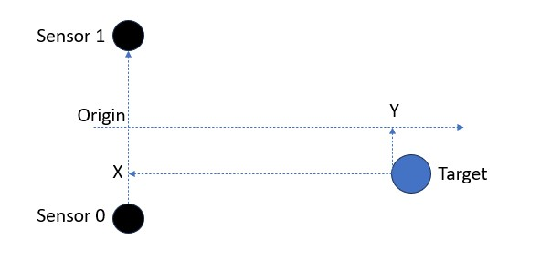
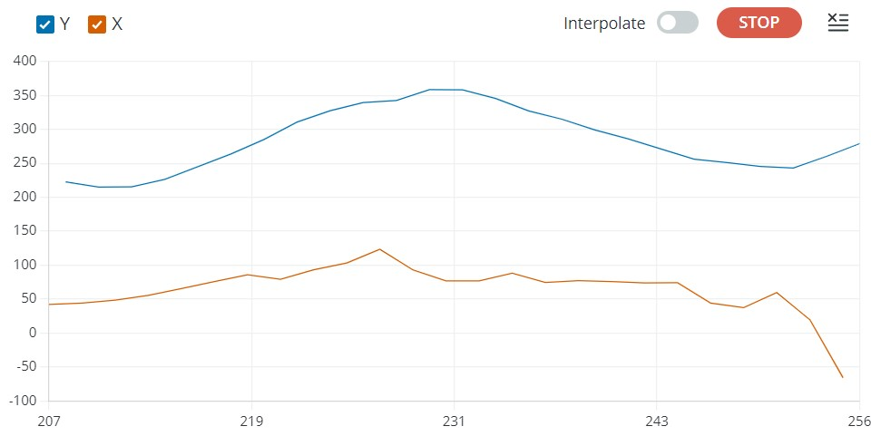
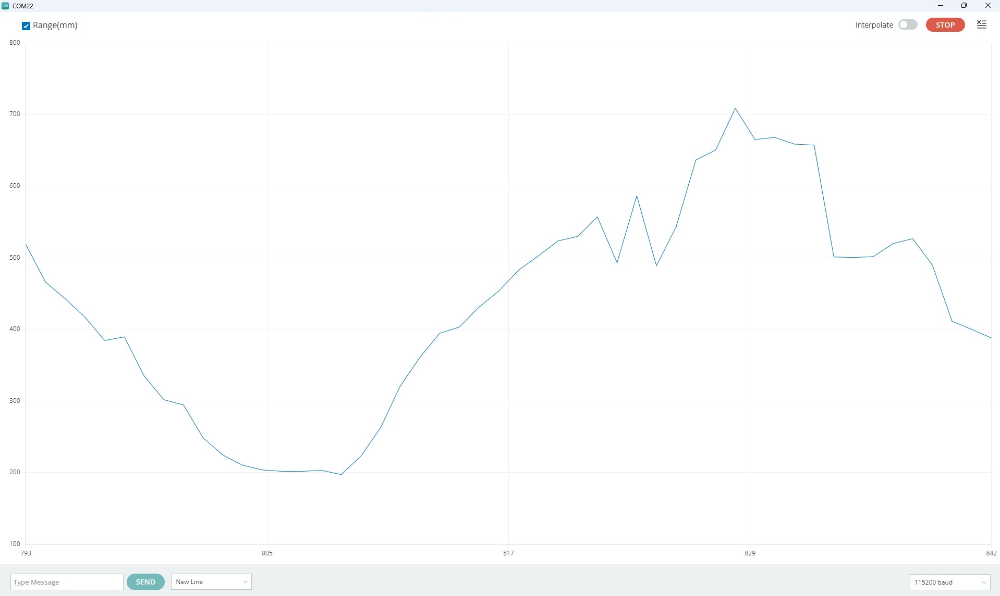

# CHx01 Arduino library
This arduino library for the [TDK/Invensense CHx01 Time-of-Flight sensors](https://invensense.tdk.com/smartsonic/).
The CHx01 devices are miniature, ultra-low power, long-range ultrasonic Time-of-Flight (ToF) range sensor.
This library supports CH101 and CH201 devices.

# Software setup
Use Arduino Library manager to find and install the CHx01 library.

# Hardware setup
There is currently no Arduino shield for the CHx01 sensors.  
The wiring must be done manually between the Arduino motherboard and the Ultrasonic ToF EVK board (which is part of the [TDK Design Kit DK-x0201](https://invensense.tdk.com/products/dk-x0201/)).  
The below wiring description is given for an Arduino Zero board:

|Arduino Zero|Ultrasonic ToF EVK board|
| --- | --- |
| 3V3           | J10.1          |
| 5V            | J10.19         |
| GND           | J7.3           |
| SDA           | J6.21          |
| SCK           | J6.19          |
| INT1_0=DIG.2  | J7.16          |
| INT_DIR=DIG.8 | J7.26          |
| RST=DIG.9     | J7.10          |
| PROG0=DIG.10  | J7.28          |

On Ultrasonic ToF EVK, connect EN_1v8 to 3v3

|3v3|EN_1v8|
| --- | --- |
| J1.7 | J1.14 |


The CHx01 sensor module must be connected with a flex to the J11 connector (Device 0 port).

**Note:** On CHx01 sensor, the interrupt is a 1v8 bidirectional signal going through a level shifter (present on Ultrasonic ToF EVK board) as Arduino IOs are 3v3.
The INT_DIR signal controls the direction of the interrupt throught the level shifter.
If no level shifter is required in your design (or when using a level shifter not having a direction pin), INT_DIR can be left unconnected.

## Adding a second sensor

This library includes triangulation sketches requiring 2 CHx01 sensors.
The second CHx01 sensor module must be connected with a flex to the J13 connector (Device 1 port).  
Other additional signals are required:

|Arduino Zero|Ultrasonic ToF EVK board|
| --- | --- |
| INT1_1=DIG.3  | J7.18          |
| PROG1=DIG.11  | J7.30          |

# Library API

## Create CHx01 instance

**CH101(TwoWire &i2c_ref, uint8_t int1_id, uint8_t int_dir_id, uint8_t reset_id, uint8_t prog_id, bool rst_n=true)**

Create an instance of the CH101 that will be accessed using the specified I2C. The IO numbers to be used as interrupt, interrupt direction,
reset and program must be specified.  
Reset pin is active LOW by default, set rst_n to false to make it active HIGH (required for the Ultrasonic ToF EVK board).
If int_dir pin is not used, it can be  set to UNUSED_PIN.

```C++
CH101 CHx01(Wire,2,8,9,10,false);
```

**CH201(TwoWire &i2c_ref, uint8_t int1_id, uint8_t int_dir_id, uint8_t reset_id, uint8_t prog_id, bool rst_n=true)**

Create an instance of the CH201 that will be accessed using the specified I2C. The IO numbers to be used as interrupt, interrupt direction,
reset and program must be specified.  
Reset pin is active LOW by default, set rst_n to false to make it active HIGH (required for the Ultrasonic ToF EVK board).
If int_dir pin is not used, it can be  set to UNUSED_PIN.

```C++
CH201 CHx01(Wire,2,8,9,10,false);
```

## Initialize the CHx01
Call the begin method to execute the CHx01 initialization routine. 

**int begin()**

Initializes all the required parameters in order to communicate and use the CHx01 sensor.

```C++
CHx01.begin();
```

## Start sensor

**int free_run()**

This method configure and starts the sensor in free run mode with maximum detection range and a measure interval set to 100ms.

```C++
CHx01.free_run();
```

**int free_run(uint16_t max_range_mm, uint16_t interval)**

This method configure and starts the sensor in free run mode with a detection range and a measure interval provided by the user.
Maximum detection range is in mm, maximum values are 1200 mm for CH101 and 5000 mm for CH201. 
Measure interval is in ms. 

```C++
CHx01.free_run(500, 200);
```


## Get Sensor Data

**bool data_ready()**

The function returns true if a measure is available, false if not.

```C++
if(CHx01.data_ready())
{
    Serial.println("A measure has completed");
}
```

**uint8_t get_iq_data(ch_iq_sample_t&ast; iq_data, uint16_t nb_samples)**

This method gets the sensor raw I/Q data.
The function returns 0 when successful (non-zero value if an error occurs).
*iq_data* must be an array of *CH101_MAX_NUM_SAMPLES* or *CH201_MAX_NUM_SAMPLES* elements of *ch_iq_sample_t* (see definition below)

```C++
ch_iq_sample_t raw_data[CH101_MAX_NUM_SAMPLES];
uint16_t nb_samples;
/* Get raw data from the sensor */
CHx01.get_iq_data(raw_data,&nb_samples);
Serial.println("CHx01 Raw Data");
for (int count = 0; count < nb_samples; count++) {
  /* output one I/Q pair per line */
  Serial.print(raw_data[count].q);
  Serial.print(",");
  Serial.println(raw_data[count].i);
}
```

**ch_iq_sample_t**

This structure is used by the CHx01 driver to return raw I/Q sensor data. Available data is:

|Field name|description|
| --- | --- |
| q | Q component of sample |
| i | I component of sample |


## Get range with CHx01 instance

**float get_range(void)**

This method returns the detected range in mm.
Range is set to 0, if no target is found.

```C++
float range_mm = CHx01.get_range();
Serial.print("Range(mm):");
Serial.println(range_mm);
```

## Using 2 sensors

**CH101_dev(TwoWire &i2c_ref, uint8_t i2c_addr, int int1_id, int int_dir_id, int prog_id)**

This method creates an instance of CH101 device, using provided I2C instance and address, and specified pins for interrupt, int direction and program.

```C++
CH101_dev dev0(Wire, CHIRP_DEVICE0_I2C_ADDR, 2, 8, 10);
```

**CH201_dev(TwoWire &i2c_ref, uint8_t i2c_addr, int int1_id, int int_dir_id, int prog_id)**

This method creates an instance of CH201 device, using provided I2C instance and address, and specified pins for interrupt, int direction and program.

```C++
CH201_dev dev0(Wire, CHIRP_DEVICE0_I2C_ADDR, 2, 8, 10);
```

**CHx01(CHx01_dev& dev0, CHx01_dev& dev1, int rst_id, bool rst_n=true)**

This method creates a group of CHx01 devices with dev0 & dev1, using specified pin for reset (rst_n specifies its polarity).  
In order to work together, CHx01 devices must be part of a sensor group.

```C++
CH101_dev dev0(Wire, CHIRP_DEVICE0_I2C_ADDR, 2, 8, 10);
CH101_dev dev1(Wire, CHIRP_DEVICE0_I2C_ADDR, 3, 8, 11);
CHx01 CHx01(dev0,dev1, 9, false);
```

**int start_trigger(uint16_t range_mm)**

When using multiple CHx01 sensors, they must be synchronized to work together.
This method starts first sensor as "emitter and receiver" and second sensor as "receiver only".
Measurements will be triggered using the interrupt pins.
The max range must be specified in mm.

```C++
CHx01.start_trigger(500);
```

**void trig(void)**

This method is used to trigger a measurement for a group of CHx01 sensors.

```C++
CHx01.trig();
```

**bool data_ready(int sensor_id=0)**

The function returns true if a measure is available for the specified sensor id, false if not.

```C++
if(CHx01.data_ready(0)&&CHx01.data_ready(1))
{
    Serial.println("A measure has completed");
}
````

**int triangulate(const float distance_between_sensors_mm, float& x, float& y, float offset=0)**

This method is used to compute the plane triangulation of a target using CHx01 measurements.
To get a valid triangulation using this method, CHx01 sensors must be placed at a certain distance and must be "looking" into the same direction.
The distance between the sensors must be specified as an input, *x* and *y* are the triangulation ouputs.
The *x* output corresponds to the target "left-right" position, while *y* corresponds to the distance of the object.
The method returns negative value if the triangulation computation is impossible (no target or multiple targets detected,...), 0 otherwise.
A distance offset might be specified in case measured sensor ranges are not aligned.

```C++
float x,y;
if(CHx01.triangulate(DISTANCE_BETWEEN_SENSORS_MM,x,y)==0)
{
  Serial.print("X:");
  Serial.println(x);
  Serial.print(" Y:");
  Serial.println(y);
}
```



# Available Sketches

**CH101_TargetDetection**

This sketch initializes a CH101, and starts the Time-of-Flight in free run mode. The detected range is printed on the Serial monitor, and can be plotted with the Serial plotter.  
**Note:** There are two different CH101 modules available, featuring ultra-sound horns with different Field of View.
The omnidirectional module detects target at 180° at a reduced range, while the 45° module is more directive and allows detections at a higher range.


**CH101_RawData**

This sketch initializes a CH101, and starts the Time-of-Flight in free run mode. For each sample, the raw I/Q data is printed on the Serial monitor.

**CH101_Triangulation**

This sketch initializes a group of two CH101 sensors, and starts the triangulation. It uses omnidirectional horns with a distance of 60mm between sensors. For each sample, X and Y target coordinates are printed on the Serial monitor.



**CH201_TargetDetection**

This sketch initializes a CH201, and starts the Time-of-Flight in free run mode. The detected range is printed on the Serial monitor, and can be plotted with the Serial plotter.



**CH201_RawData**

This sketch initializes a CH201, and starts the Time-of-Flight in free run mode. For each sample, the raw I/Q data is printed on the Serial monitor.

**CH201_Triangulation**

This sketch initializes a group of two CH201 sensors, and starts the triangulation. It uses a distance of 105mm between sensors. For each sample, X and Y target coordinates are printed on the Serial monitor.


